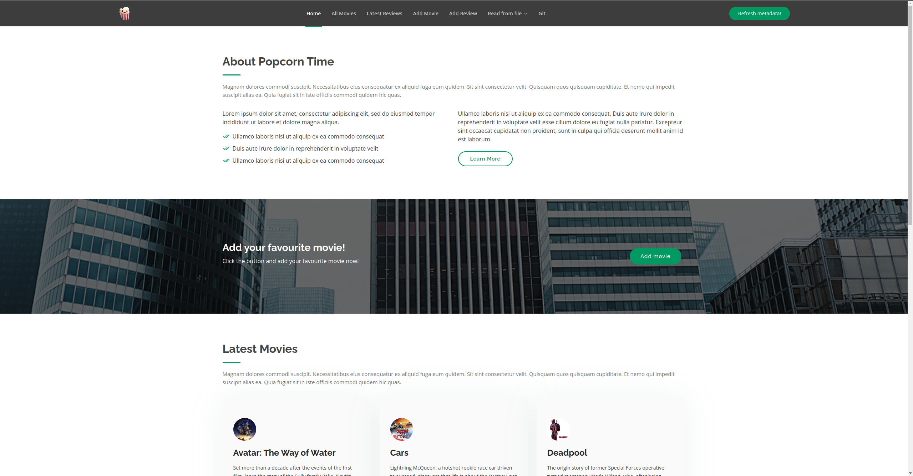

## Requirements

Before you start, make sure you have the following installed on your machine:
- Git (https://git-scm.com/)
- Composer (https://getcomposer.org/download/)
- Docker
- Symfony CLI (https://symfony.com/download)
- PHP 8.x w/ extensions (see `symfony check:requirements`) 
> Default extensions needed are:  `Ctype`, `iconv`, `PCRE`, `Session`, `SimpleXML` & `Tokenizer`

## Get Git set up & the project files on your PC
1. Clone our repository, you can find it here: https://github.com/databrydge/popcorn-time
2. Create a private repository on your own account named "popcorn-time"
3. Push our repository onto your own account (make sure the history and commits of our repository are visible in yours as well)
4. Invite us [barra66](https://github.com/barra66)) to the repository as collaborators.
5. Make sure to check out into a different branch before you do any coding, for more info on why see the [rules](README.md#assignment-rules-for-submission)

## Setting up Symfony to run locally
- Open a terminal and navigate to your local project folder
- Start off with the good & classic: `composer install`
- Attach the domain to your proxy: `symfony proxy:domain:attach popcorntime`
- Install the certificate: `symfony server:ca:install`
- Run the proxy service: `symfony proxy:start`
- Start the server: `symfony server:start` (add `-d` if you want it daemonized)
- Now before you can connect to the server, you will need to set up your local proxy configuration, you can find the detailed guide for your OS [here](https://symfony.com/doc/current/setup/symfony_server.html#setting-up-the-local-proxy)
- Quick tip, if you are ever stuck on the proxy not working, try turning your local proxy off and on in your settings.

## Setting up the database & the docker service (on Linux & Mac OS)

- Open a new terminal and navigate to your local project folder if you didn't run the server daemonized
- Run: `sudo docker-compose up` (`sudo` not needed on mac) to install and run your docker environment  
  *(add `-d` if you want to run it daemonized)*
- Run the migrations: `symfony console doctrine:migrations:migrate` to setup the database
- Run the fixtures/seeders: `symfony console doctrine:fixtures:load` to fill the database with dummy data
- Your docker is now setup, for the old school users, I added a phpmyadmin image, so you can still access that @ `127.0.0.1:8180`

### For Windows users
You have the option to run the docker in a WSL2 container run it through the UI inside windows, or you can decide not to use the docker at all & use some software solution to run the databases locally like WAMP or something similar. Whichever way you want to run it on Windows is up to you.

All the credentials for the database connection can be found inside the `.env` file, inside the `DATABASE_URL` constant. Simply setup your wamp to reflect that or change the credentials in the string.  
**Small note, if you are using default WAMP setup, know that the default MySQL port is going to be `3306` not `3309` as currently used in the `.env`**

## Done!
You should see the homepage of the app now @ https://popcorntime.wip and it should look something like this:

Grab yourself a cup of :coffee: or :tea: and a :cookie: you're good to go & get started with the exercise! 
Back to the [readme](README.md).
